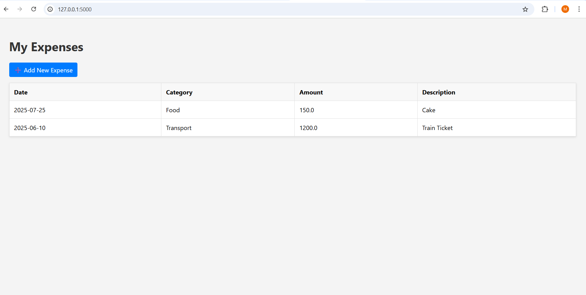

# 💰 Personal Expense Tracker (Flask Web App)

A simple and clean full-stack web application to track daily expenses, built using **Python Flask**, **SQLite**, and **HTML/CSS**.

## Features
- Add new expenses
- Categorize expenses (Food, Transport, etc.)
- View all past transactions
- Clean and simple interface

## How to Run
1. Open terminal
2. Type: `pip install flask`
3. Type: `python app.py`
4. Open browser and go to: http://127.0.0.1:5000

## 📷 Screenshot

